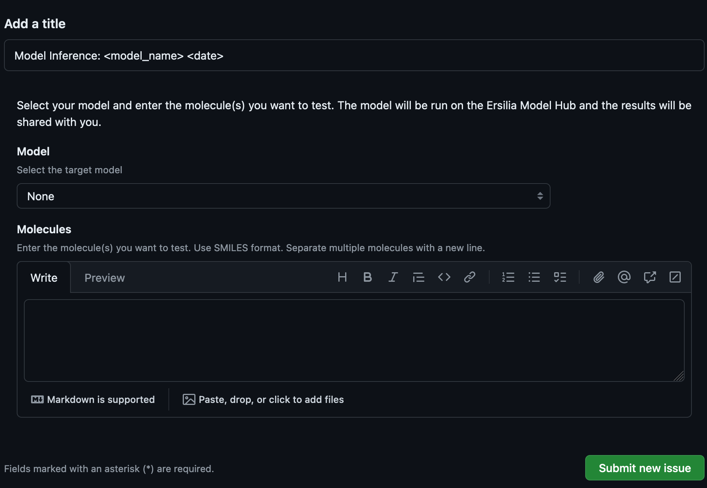

# 🤖 Welcome to Ersilia Self Service!
Ersilia Self Service is a self-service repository where you can request predictions on your dataset from any of the [models](https://www.ersilia.io/model-hub) available within the Ersilia Model Hub. To get started, simply navigate to issues menu and create a new "Model Inference Run" [issue](https://github.com/ersilia-os/ersilia-self-service/issues/new?assignees=&labels=model-inference-run&projects=&template=model-inference-run.yml&title=Model+Inference%3A+%3Cmodel_name%3E+%3Cdate%3E). 

Select a model using the `Model` dropdown, and then add your SMILES data in the `Molecules` text field, with each molecule separated by a new line, and submit the issue. Once the results for your dataset are ready, you will be notified in this issue and the results will be made available to you through a public URL.

## 💊 How Does it Work?
This self-service framework utilizes the computing capacity available in GitHub Action runners to fetch a requested model and run it on the provided dataset. The results are then stored as GitHub artifacts. <b>Please note that these results are only stored for 30 days after which they will be removed.</b>

## 💊 Note on Privacy
The aim of this project is to make our models available to the general public anywhere in the world while removing the need for any computational resources or coding expertise. This means that any activity on this repository is also open and available to the general public. We highly recommend not working with private or sensitive data while using this service, or doing so at your own risk.

## 💊 List of Models
You can browse the list of available models on our [website](https://www.ersilia.io/model-hub). At present, the Ersilia Model Hub has over 150 models and we constantly keep expanding this list. When you open an issue, there's a slim chance that you may not see a model in the dropdown that is in fact available in the Hub. This is not a cause for concern as the Model dropdown gets updated every day, and you can try again the next day.

# 👩‍💻 Contributors 👨‍💻

This work would not have been possible without the support of our wonderful volunteers!

- [Jenna Massardo](https://github.com/jmassardo)
- [Sean Marcia](https://github.com/seanmarcia)
